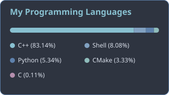

# Gor Melkumyan

**Software Engineer | Applied Mathematician**

---

Master's student in Applied Statistics and Data Science at Yerevan State University. I focus on cryptography and mathematical problem-solving.

### Current Work
- C Developer / Software Engineer at HAPALS Technology
- Working on cryptographic implementations and security-focused code

### Technical Stack
**Languages:** C, C++, Bash  
**Tools:** Linux CLI, Git/GitLab, CMake, GoogleTest, Makefiles  
**Focus Areas:** Systems programming, cryptography, algorithm design, mathematical modeling

### On GitHub
Most of my repositories involve:
- Low-level C/C++ implementations
- Mathematical problem solutions

### Connect
Email: gormelqumyan6@gmail.com  
LinkedIn: https://www.linkedin.com/in/gor-melkumyan-0b7279225/  
Location: Yerevan, Armenia
